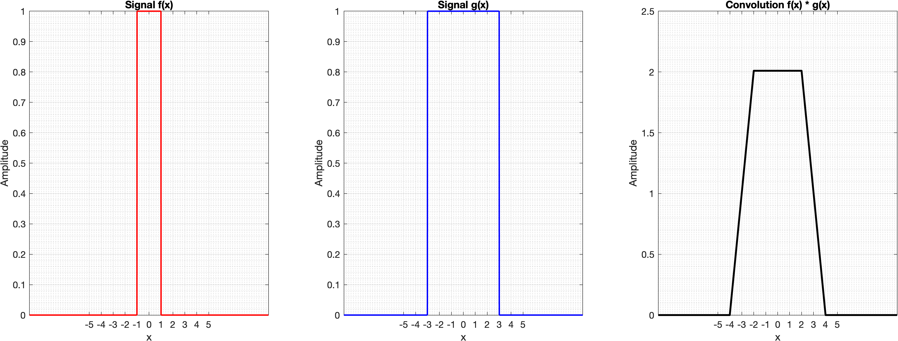

# Continuous Signal Convolution in MATLAB

A MATLAB implementation for numerical approximation of the continuous-time convolution integral using discrete convolution and signal sampling.




## Overview

Convolution is one of the fundamental operations in signal processing, systems theory, image processing, and engineering applications.

This project demonstrates how the continuous convolution operation between two arbitrary continuous functions can be approximated numerically using MATLAB's discrete convolution algorithm.

The implementation allows users to define their own input functions and visualize:

- The first input signal \( f(x) \)
- The second input signal \( g(x) \)
- The resulting convolution \( f(x)*g(x) \)


## Mathematical Background

The continuous convolution of two functions is defined as:

\[
(f*g)(x)=\int_{-\infty}^{\infty} f(t)g(x-t)\,dt
\]

In numerical computation, the integral is approximated by sampling the continuous signals over a discrete domain:

\[
(f*g)(x) \approx \Delta x \sum_{n} f(n)g(x-n)
\]

where:

- \( \Delta x \) is the sampling interval
- The summation represents the discrete approximation of the convolution integral


## Computational Method

The workflow of this project is:

1. Define the sampling domain.

2. Provide two continuous functions using MATLAB function handles.

Example:

```matlab
f = @(x) exp(-x.^2);

g = @(x) double(abs(x)<=2);
```

3. Evaluate the functions over the sampling grid.

4. Apply MATLAB's discrete convolution algorithm:

```matlab
conv(signal_f, signal_g, 'same')
```

5. Scale the result by the sampling interval:

```matlab
result = conv(signal_f, signal_g, 'same') * dx;
```

This scaling converts the discrete summation into an approximation of the continuous convolution integral.


## Features

- Supports arbitrary user-defined continuous functions
- Uses MATLAB function handles for flexible signal definition
- Numerical approximation of continuous convolution
- Visualization of input and output signals
- Automatic export of high-resolution results


## Project Structure

```
Continuous-Convolution-MATLAB/

│
├── continuous_convolution.m
│   Main convolution function
│
├── convolution_demo.m
│   Example implementation and visualization
│
├── figures/
│   Output figures
│
└── README.md
```


## Usage

Clone this repository and run:

```matlab
convolution_demo
```

Users can modify the input functions:

```matlab
f = @(x) ...
g = @(x) ...
```

to investigate the convolution behavior of different signals.


## Example

The default example calculates the convolution between:

Gaussian function:

\[
f(x)=e^{-x^2}
\]

and a rectangular pulse:

\[
g(x)=
\begin{cases}
1, & |x|\leq2\\
0, & otherwise
\end{cases}
\]


The output demonstrates the smoothing effect produced by convolution between a Gaussian signal and a finite-width pulse.


## Applications

Continuous convolution is widely used in:

- Signal processing
- Linear time-invariant (LTI) system analysis
- Image processing and filtering
- Probability theory
- Physics and engineering simulations
- Medical imaging and radiation transport modeling


## Requirements

- MATLAB R2020b or later
- Signal Processing Toolbox is not required


## Author

**Mohammadreza Abdolmaleki**

Medical Physics Student

Interested in:
- Radiation Physics
- Computational Modeling
- Signal Processing
- Scientific Computing


## License

This project is released under the MIT License.